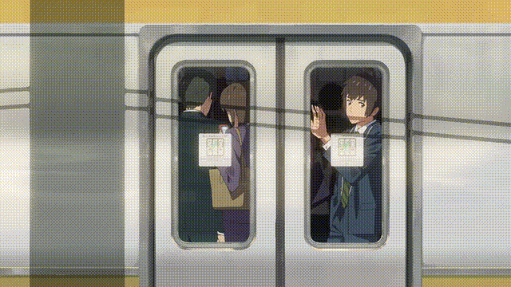

# Lo-Fi Background GIF Generation

Simple script to generate Lo-Fi backgrounds from input videos

## How it works

1. OpenCV2 reads input video
2. Extracts specified number of random clips of specified length from video 
3. Transform clip to optimize for GIF (resize & drop fps)
4. Write GIF

## Examples from Howl's Moving Castle & Kimi No Na Wa
  
 

## To-do

1. Refactor & Tidy script (most things are bodged together and/or hard-coded as of now)
2. Implement Effects: lots of those lo-fi backgrounds have effects such as chromatic abberation & lens blur.
3. Smarter clip selection: Sometimes the clip will be from the ending credits. Or sometimes the clip will have awkwardly timed cuts between scenes.

